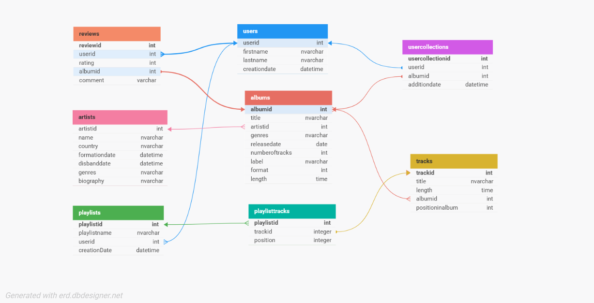

# MusicalCollection

This is a simple C# EF MusicalCollection app
The task was:

	4. Створити додаток «Музична колекція»
Розробити додаток для ведення та управління музичною колекцією користувача, який
дозволяє додавати, сортувати, шукати та переглядати інформацію про музичні альбоми та
виконавців. Додаток має підтримувати категоризацію альбомів, рейтингову систему та
можливість створення персональних списків.
Необхідно зберігати наступну інформацію:
	- **Альбоми**: назва, виконавець, жанр, рік випуску, кількість треків, лейбл, формат (CD,
вініл, цифровий).
	- **Треки**: назва, тривалість, альбом, номер у списку, автор музики, автор тексту.
	- **Виконавці**: ім'я/назва гурту, країна, активність (роки діяльності), жанри, біографія.
	- **Колекція користувача**: перелік альбомів, дата додавання, статус (куплено, бажане).
	- **Рейтинги та відгуки**: користувач, альбом, оцінка (1-5 зірок), коментар.
	- **Списки відтворення**: назва списку, автор, перелік треків, дата створення.

### DB diagram

For better view go to [DB diagram](https://dbdesigner.page.link/GN9LRu7Tjwbm7Zhc8)!

## Available Commands

### 📥 Collection & Wishlist
- **`add-to-collection AlbumName`** – Add an album to your wishlist.
- **`buy-album AlbumName`** – Mark an album as purchased (adds it to your collection if not already there).
- **`show-collection`** – List all albums in your collection.
- **`show-wishlist`** – Display albums in your wishlist.
- **`show-bought`** – Display your purchased albums.

### 🎧 Playlists
- **`add-to-playlist TrackName PlaylistName`** – Add a track to a playlist.
- **`remove-from-playlist TrackName PlaylistName`** – Remove a track from a playlist.
- **`add-new-playlist PlaylistName`** – Create a new playlist.
- **`delete-playlist PlaylistName`** – Delete a playlist and its tracks.
- **`show-playlist PlaylistName`** – Show tracks in a specific playlist.
- **`show-my-playlists`** – List all your playlists.

### ⭐ Ratings
- **`set-rate AlbumName Rate`** – Set a rating (1–5) for an album.
- **`show-rates`** – Display all your album ratings.
- **`search-albums-by-rate Rate`** – List albums with a specific rating.

### 🔍 Search & Display
- **`show-album AlbumName`** – Display details of an album.
- **`show-albums ArtistName`** – List all albums by a specific artist.
- **`show-albums-by-genre GenreName`** – List albums by genre.
- **`search-track TrackName`** – Search for tracks by name (or partial name).
- **`search-artist ArtistName`** – Search for artists by name (or partial name).
- **`search-album AlbumName`** – Search for albums by name (or partial name).

### 🛠️ Other
- **`help`** – Show the list of available commands.
- **`exit`** – Exit the application.
